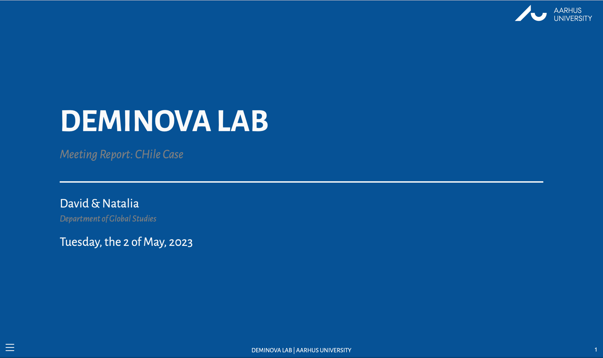

## `Quarto` `Reveal.js` Template - [`Aarhus University`](https://international.au.dk)

This is a repository for the `Quarto` `revealjs` [template example](https://raw.githack.com/davidycliao/quarto-revealjs-aarhus/main/aarhus-template.html) customized for `Aarhus University`blue color scheme, and adaptation of [`quarto-revealjs-coeos`](https://github.com/mcanouil/quarto-revealjs-coeos). 

## Documentation

[`Quarto` documentation on `revealjs` format.](https://quarto.org/docs/presentations/revealjs/)